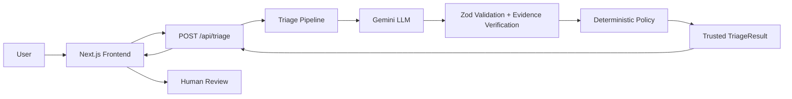
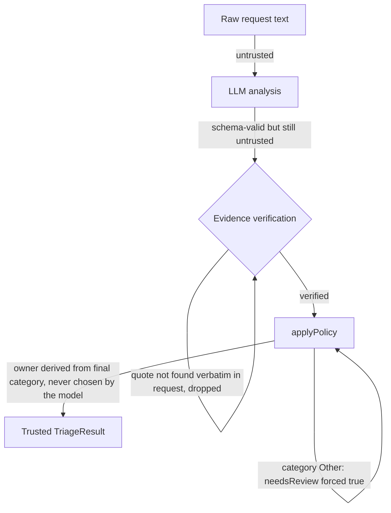
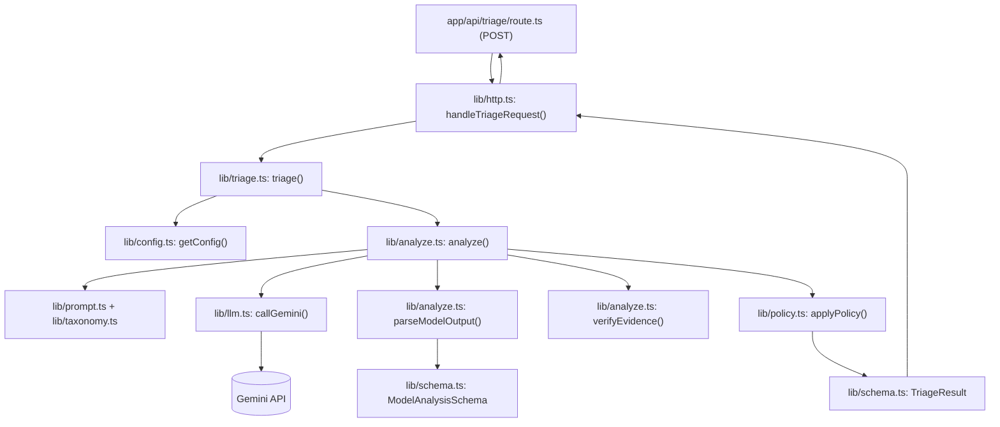
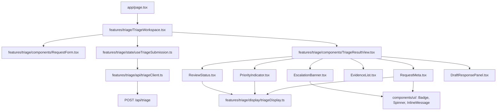

# TriageDesk

TriageDesk is an AI-powered request triage assistant. It takes an unstructured client request — an email, a form submission, a chat message — and turns it into a short summary, a category, a priority with a stated reason, an owning team, and a draft first response, so a human reviewer can act on it in seconds instead of reading, judging, and routing it by hand.

## Live Demo

**Production:** https://triagedesk-kohl.vercel.app

Paste any of the six mock requests from the assessment, or write your own — the system is built to generalize beyond a fixed set of examples.

## What It Does

```
Customer request → AI analysis → schema validation + evidence verification → deterministic policy → trusted result → human review
```

For every request, TriageDesk returns:

- A short **summary** of the request
- Exactly one **category**: Sales, Support, Billing, Technical, or Other
- Exactly one **priority**: Low, Medium, High, or Urgent — with a brief stated reason
- Exactly one **owner**, derived from the category: Sales Team, Client Success, Finance, or Engineering
- A **draft first response**, written for a human to review
- A **review flag** (`needsReview`) set when a person should look before anyone acts, with a reason
- **Evidence**: short verbatim quotes from the request that justify the priority or a safety flag
- A **security/privacy escalation note** when the request indicates exposed data or a critical outage

The draft response is inert text. TriageDesk never sends an email, opens a ticket, or takes any action on its own — every output exists for a human to review and act on.

## Architecture



The core design principle is **the LLM proposes, deterministic code enforces**:



The model never chooses an owner — it is derived from the final category by a fixed lookup, so category and owner can never disagree. Every evidence quote the model returns is independently re-checked as a verbatim substring of the original request before it is trusted; anything that doesn't match is silently dropped, never repaired or guessed. The trusted result cannot bypass the implemented schema, evidence, owner-mapping, and policy invariants — malformed or adversarial model output is rejected by a strict Zod schema, and a request that tries to instruct the model directly (prompt injection) is treated as untrusted data, not as instructions. Safety-floor enforcement (raising category/priority toward Technical/Urgent) is dependent on the model identifying the corresponding signal (`dataExposure`/`criticalOutage`); the prototype does not maintain a second, independent raw-text detector for these conditions — see Limitations.

## Backend Architecture



| Component | Responsibility |
|---|---|
| `app/api/triage/route.ts` | The only HTTP entry point (`POST`). Delegates immediately to `handleTriageRequest()`. |
| `lib/http.ts` | Thin adapter: parses the JSON body, calls `triage()`, maps every error code to the correct HTTP status, and logs safe metadata only (never request text, prompts, or model output). |
| `lib/triage.ts` (`triage()`) | Orchestrates the pipeline: validates the input, loads config, calls `analyze()`, then `applyPolicy()`. |
| `lib/prompt.ts` + `lib/taxonomy.ts` | The system prompt and the domain taxonomy (categories, priorities, owners, tie-breakers) it is generated from, so the prompt and the enforcement code can't drift apart. |
| `lib/llm.ts` (`callGemini()`) | The only module that talks to the Gemini API. Converts any provider failure into a safe, fixed-message `TriageError`. |
| `lib/schema.ts` (`ModelAnalysisSchema`) | Validates the model's raw JSON output. This is the **model proposal** — schema-valid, but still untrusted. |
| `lib/analyze.ts` (`verifyEvidence()`) | Independently re-checks every evidence quote against the original request text; unverifiable quotes are dropped. |
| `lib/policy.ts` (`applyPolicy()`) | Pure, deterministic function: enforces the safety floors, forces review for category Other, and derives the owner. Produces the **trusted result**. |
| `lib/schema.ts` (`TriageResult`) | The final, trusted output shape, re-validated with its own cross-field invariant (owner must match category). |

The distinction that matters: everything up to and including `ModelAnalysisSchema` validation is a **model proposal** — plausible, schema-shaped, but not yet trusted. Only after `verifyEvidence()` and `applyPolicy()` run does the pipeline produce a **trusted result**, and that is the only shape ever returned to the client.

## Frontend Architecture



The frontend follows Atomic Design, without a Template layer:

- **Atoms** (`components/ui/`) — `Badge`, `Spinner`. Domain-agnostic, reusable outside this feature.
- **Molecules** — `InlineMessage` (`components/ui/`), and `RequestMeta`, `PriorityIndicator`, `ReviewStatus`, `EvidenceList`, `EscalationBanner`, `DraftResponsePanel` (`features/triage/components/`). Each renders one already-decided piece of the result.
- **Organisms** — `RequestForm` (owns the editable draft text), `TriageResultView` (composes the six molecules in a fixed order), `TriageWorkspace` (owns the submission lifecycle and wires the two together).
- **Page** — `app/page.tsx` renders `TriageWorkspace`.

There is no Template layer because this prototype has exactly one page and one workflow; an intermediate layer would separate layout from content with nothing left to vary between them, so it was deliberately left out rather than added preemptively.

Dependency direction is one-way: page → organisms → molecules → atoms, never the reverse. Only `triageClient.ts` is allowed to call `/api/triage` — no component calls `fetch` directly. Presentation components never fetch data and never compute category, priority, owner, review state, evidence, or escalation; they only render values the backend already decided. `triageDisplay.ts` is the single place that maps a trusted domain value (`Category`, `Priority`, `Owner`, `needsReview`) to a label and a visual tone — it has no knowledge of how that value was decided.

## AI Decision Flow

```mermaid
flowchart LR
    REQ["Customer request"] --> PT["Prompt + taxonomy"]
    PT --> GEM["Gemini"]
    GEM --> PROP["Untrusted model proposal"]
    PROP --> ZOD["Zod validation"]
    ZOD --> EVID["Evidence verification"]
    EVID --> POL["Deterministic policy"]
    POL --> OWN["Owner derivation"]
    OWN --> TRUST["Trusted TriageResult"]
    TRUST --> HUMAN["Human review"]
```



The model is responsible for interpreting natural language — summarizing the request, classifying it, judging priority, deciding whether it needs review, and drafting a response. Deterministic code is responsible for enforcing invariants: validating shape, verifying evidence, deriving the owner, and applying the two named safety floors. The model's output is never returned directly. It is validated, evidence-checked, and passed through deterministic policy before the final trusted `TriageResult` is returned.

## Human Review and Safety

- Drafts are never sent automatically — no code path in the application sends email, opens a ticket, or takes any action.
- The UI explicitly identifies the response as a draft: `DraftResponsePanel` captions it "This draft has not been sent. Review and send it yourself if appropriate."
- The prompt forbids drafts from implying a completed action (contacted, ticketed, escalated, investigated, removed, refunded, credited, scheduled, fixed) and forbids promising a future one, including for data exposure or an outage. It also forbids invented prices, timelines, ETAs, SLAs, discounts, and guarantees.
- `needsReview` is independent of severity: a clear, complete, even severe request can still have `needsReview: false`. It identifies requests where additional human review is needed because ambiguity, mixed intent, category `Other`, adjacent priority uncertainty, or manipulation could affect the triage decision.
- The security/privacy escalation note is a separate field from the customer-facing draft, so escalation detail is never mixed into text a customer might eventually see.
- If a submission fails, the text the user typed is preserved so they can resubmit without retyping it — `RequestForm` never clears the draft on submit.

## Evidence Verification

1. The model proposes evidence: short quotes it believes justify the priority, `dataExposure`, or `criticalOutage` judgment.
2. `verifyEvidence()` (`lib/analyze.ts`) independently checks whether each quote exists verbatim — after case-folding, straight-quote normalization, and trimmed surrounding whitespace/punctuation, with no fuzzy matching — as a substring of the original request text.
3. Only quotes that pass this check are included in the trusted result.
4. An unverifiable quote is dropped, not corrected or replaced. The model can propose evidence, but only evidence verified against the original request is included in the trusted result.

## Decision Model

| Category | Owner |
|---|---|
| Sales | Sales Team |
| Support | Client Success |
| Billing | Finance |
| Technical | Engineering |
| Other | Client Success |

Categories, briefly: **Sales** is new or expanded paid work; **Support** is an existing client using the product with nothing broken; **Billing** is money on existing work; **Technical** is a defect, outage, or exposure in our systems; **Other** is anything that doesn't fit (spam, vendors, recruiting, press). Priorities range from **Low** (informational, nothing lost by waiting) to **Urgent** (active or imminent harm, exposure, or a critical outage), with impact weighted ahead of stated deadline, and deadline ahead of tone. The full definitions and tie-breakers live in `lib/taxonomy.ts` and are generated directly into the prompt, so they can't drift apart.

## Getting Started

Requires Node 22+ (pinned in `.nvmrc`) and a Gemini API key.

```bash
npm install
cp .env.example .env.local   # fill in GEMINI_API_KEY
npm run dev                  # http://localhost:3000
```

| Variable | Required | Default | Notes |
|---|---|---|---|
| `GEMINI_API_KEY` | Yes (live mode) | — | Server-side only; never sent to the browser |
| `LLM_MODEL` | No | `gemini-3.5-flash-lite` | |
| `LLM_MODE` | No | `live` | `recorded` is defined but not implemented — see Limitations |

## Testing & Evaluation

```bash
npm test           # 360 tests, no network calls, no API key needed
npm run typecheck
npm run build
npm run eval        # live run against the real Gemini pipeline — requires GEMINI_API_KEY
```

`npm run eval` runs 21 cases — the six official assessment requests plus unseen and adversarial edge cases (mixed intent, negation, non-English, prompt injection, single-user vs. systemic outage) — against the real pipeline. Expectations are *allowed sets*, not single exact answers, because many real requests are legitimately ambiguous; the report also tracks run-to-run stability and a suspected cause for anything that doesn't conform, rather than treating every disagreement as a bug. `EVAL_PASSES`, `EVAL_DELAY_MS`, and `EVAL_CASES` env vars control repeated or targeted runs. The most recent run is committed at `eval/results/latest.md`/`.json` so its methodology and output are visible without re-running it.

## Deployment

- **Provider:** Vercel
- **Production URL:** https://triagedesk-kohl.vercel.app
- **Deployed commit:** `ec11145`

The Next.js frontend and the `/api/triage` route deploy together as a single application — there is no separate backend service. The API route runs on the Node.js serverless runtime (`export const runtime = "nodejs"`, `export const maxDuration = 30`), since the Gemini SDK isn't Edge-compatible.

Before deploying, `npm test`, `npm run typecheck`, and `npm run build` were run and confirmed passing, and `git diff --check` was clean. After deploying, the following were verified directly against the production URL: the page loads with no runtime error; all six assessment-style scenarios (Support, Sales, Billing, Technical, Security/data-exposure, Other) return the expected category, priority, owner, and review state, with the security scenario additionally confirmed to include grounded evidence, a security/privacy escalation note, and a draft that does not claim removal or promise investigation; invalid-input handling (empty request, malformed JSON) returns the correct `400` responses; and the page HTML and every client-side JavaScript bundle were scanned for the API key value, which was not found in any of them.

Responsive layout and live in-browser resubmission behavior were validated manually against the running application, not through automated deployment checks. GitHub automatic deployment is **not** currently configured — this deployment was created directly from the reviewed commit via the Vercel CLI, so a future `git push` will not redeploy it automatically.

## Design Decisions

- **LLM proposes, policy enforces.** The model is responsible for natural-language interpretation and proposal — summarizing, classifying, judging priority, and drafting text. Deterministic code is responsible for everything that must hold every time: schema validation, evidence verification, owner derivation, the two named safety floors, forced review for category Other, and the final shape of the trusted result.
- **Owner is never chosen by the model** — it's a fixed function of the final category, which makes a category/owner mismatch structurally impossible.
- **Evidence is verified, not trusted.** The model can propose evidence, but only evidence verified against the original request is included in the trusted result.
- **Drafts never claim a completed or promised action** (no "we've removed it," no "we will look into this right away"). This was a real bug found during manual validation and is now enforced by an explicit prompt rule and a regression test suite, not a keyword filter on the model's output.

## Limitations

- Nothing is sent automatically — every draft requires a human to review and send it themselves.
- The prototype is stateless per request; it does not maintain conversational history or persist requests.
- `LLM_MODE=recorded` exists in the config type as a placeholder for a future offline/fixture-based mode and intentionally errors clearly (`CONFIGURATION_ERROR: "Recorded mode is not available yet."`) if selected. It is not implemented, and production always runs `live`.
- Model judgment can vary slightly between runs on genuinely borderline requests (e.g. Medium vs. Low priority on a non-blocking bug); the evaluation harness tracks this explicitly as stability rather than hiding it.
- The safety floor only escalates on what the model reports: policy raises category/priority when the model sets `dataExposure` or `criticalOutage`, but the prototype does not run a second, independent detector over the raw request text. If the model fails to flag a real signal, policy has nothing to raise.
- This is a prototype for a technical assessment, not a production system: no authentication, no persistence layer, and no monitoring/observability beyond the safe metadata logging in `lib/http.ts`.

## Tech Stack

Next.js 16 (App Router) · React 19 · TypeScript · Zod · Tailwind CSS v4 · Gemini (`@google/genai`) · Vitest + React Testing Library

## Project Structure

```
app/                    Next.js routes: page, layout, /api/triage
lib/                    Triage pipeline: config, prompt, LLM call, schema, evidence, policy
features/triage/        Frontend feature: API client, submission state, form, result components
components/ui/          Shared presentational primitives (Badge, Spinner, InlineMessage)
eval/                   Live evaluation harness, cases, scoring, and the latest committed report
tests/                  Unit and component tests (no network calls)
```
